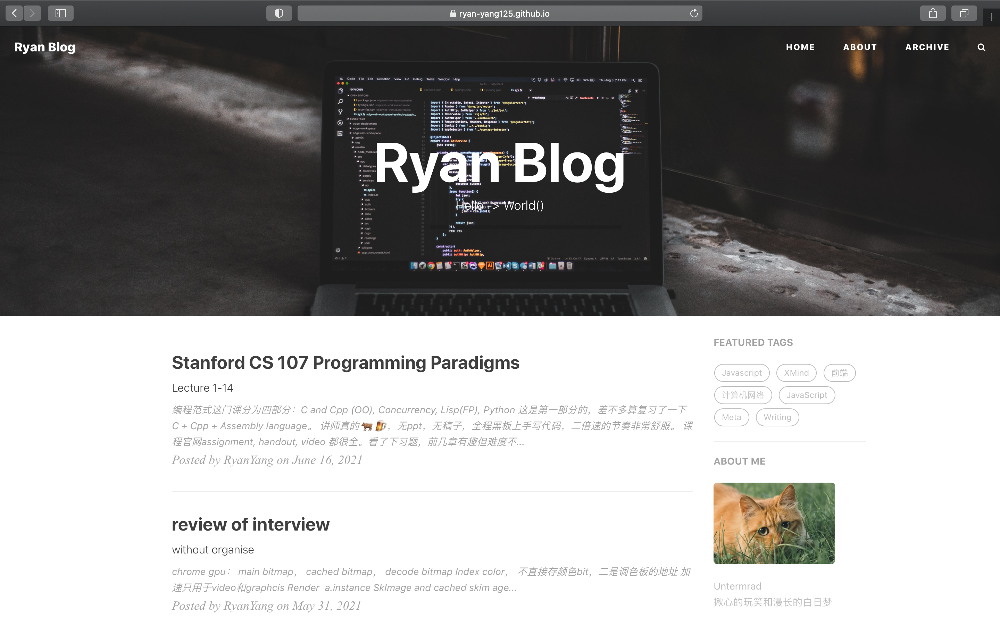

> 博客修改自[Hux](https://github.com/Huxpro/huxpro.github.io)
> 这是我的地址[Ryan](https://ryan-yang125.github.io/)

个人(技术？)博客，主要分享计算机技术（特别是Web前端相关）的知识整理和学习心得，由于博客绝大部分文章是思维导图(XMind)的形式，大致这样：

所谓开局一张图，剩下全靠编，这样非常不利于SEO，因此这里用文字简单记录一下内容。

> PS.我是真的很喜欢用思维导图了，不是很愿意详细记录学了什么（太懒了…）。
>
> 把知识结构勾勒出来，适当添加一下重点信息。过于细节的，需要的时候知道它在知识结构的哪一部分，查漏补缺。

目前打算整理以下四个方面，算是一个自己自2020/10的某天用(HTML+CSS+JS)写了第一个非常满意（在当时看来）的个人音乐网站（某个课程的小作业，没事我写网站干嘛😢）而对前端产生了兴趣的心路历程吧！

- 计算机网络

  - 应用层协议
    - HTTP(1.0~2.0)/HTTPS
    - SMTP
    - DNS
    - P2P
  - 运输层协议
    - UDP
    - TCP
      - rdt(1.0~3.0)
      - GBN
      - SR
      - 拥塞控制
  - 网络层
    - IPv4/IPv6
    - 路由选择算法
    - SDN
- JavaScript
- 浏览器
- React
- 算法