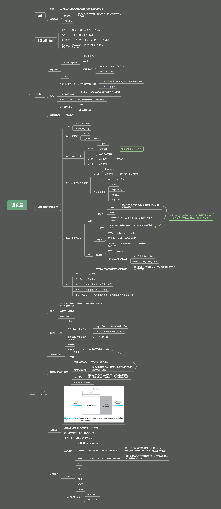

> 我不是很喜欢详细记录学了什么（太累了...）。
>
> 把知识结构勾勒出来，适当添加一下重点信息，过于细节的，需要的时候知道它在知识结构的哪一部分往里加就够了

运输层主要集中在TCP和UDP，其中难点是TCP是如何确保可靠数据传输的

1.关于TCP差错恢复机制到底是怎么样的，书也没讲清楚，只是说一种GBN和SR的结合。。。之后还要研究一下

2.GBN和SR要多画图，想想出现不同情况的差错是如何处理的就清楚了。

3.TCP和UDP的报文结构要画图

4.三次握手和四次挥手，想想每一次如果出错了会怎么样，而不是只知道每一次发什么，回什么

5.关注下运输层针对TCP的攻击(SYN,RST...)

下面是思维导图（略大）

